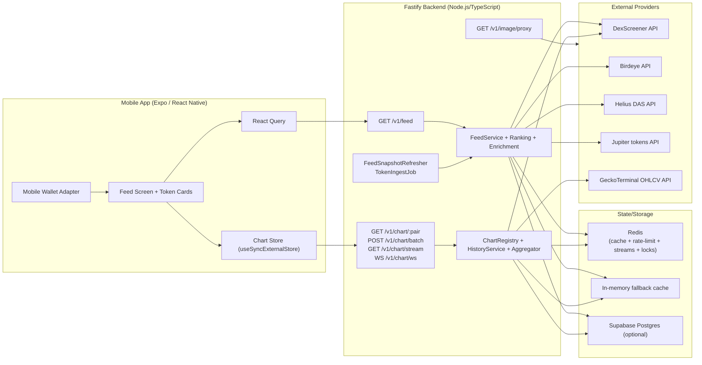
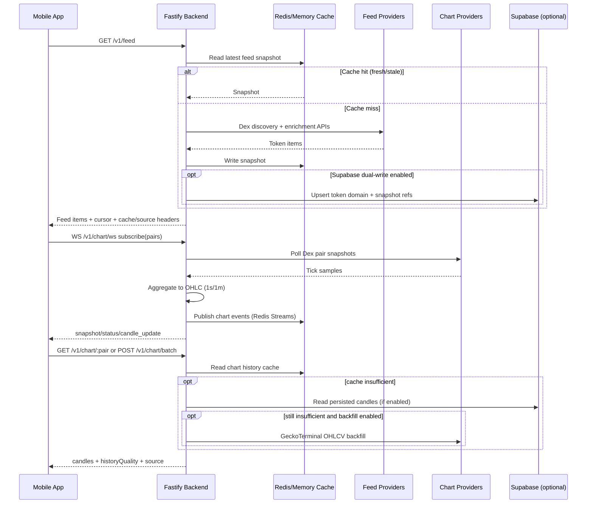

# ReelFlip Current Application Architecture and Workflow

Last updated: March 4, 2026  
Scope baseline: current code in this repository (`/Users/rawchenko/Documents/GitHub/ReelFlip`)

## 0. Executive Summary

ReelFlip is currently a **feed-first mobile app** with realtime chart updates and optional Supabase persistence.

- Frontend: Expo React Native app with TikTok-style vertical token feed.
- Backend: Fastify service (`backend/src/index.ts`) exposing feed/chart/image endpoints.
- Data providers: DexScreener (primary discovery + price snapshots), Birdeye (market enrichment), Helius DAS (metadata), Jupiter token tags (trust tags), GeckoTerminal (historical candle backfill).
- State + storage: Redis (cache + chart streams) with in-memory fallback; optional Supabase read-through/write-through for token/feed/chart domain.
- Realtime: backend publishes chart events to Redis Streams; frontend consumes via WebSocket (`/v1/chart/ws`) with SSE and polling fallback.
- Trading execution status: **not implemented end-to-end yet**. Buy/sell in feed opens a placeholder sheet; backend quote/swap/trade endpoints are planned only.

---

## 1. System Architecture

### 1.1 High-Level Architecture Diagram

### 1.2 Main Services and Components

- **Frontend app**
- Routing via `expo-router`; core feed screen in `app/(tabs)/feed.tsx`.
- Data fetch via React Query (`features/feed/api/use-feed-query.ts`).
- Realtime chart client + store (`features/feed/api/chart-client.ts`, `features/feed/chart/*`).
- Wallet features via `@wallet-ui/react-native-kit`.

- **Backend API (single Fastify process)**
- Feed route: `/v1/feed`.
- Chart routes: `/v1/chart/:pairAddress`, `/v1/chart/batch`, `/v1/chart/stream`, `/v1/chart/ws`.
- Image proxy route for token images: `/v1/image/proxy`.
- Health/metrics: `/health`, `/metrics`.

- **Background work inside same backend process**
- `FeedSnapshotRefresher`: periodic feed snapshot refresh.
- `TokenIngestJob`: periodic snapshot persistence + candle retention prune (when Supabase dual-write is enabled).

### 1.3 Infrastructure (Current)

- **Runtime host**: Node.js process for backend (local/dev + CI usage present).
- **Cache/event backbone**: Redis (optional in dev, required by policy in prod mode unless degraded start allowed).
- **Persistence**: Supabase Postgres (optional; controlled by env flags).
- **No separate worker service, no queue broker besides Redis Streams, no container/IaC manifests in repo yet.**

---

## 2. Data Sources

### 2.1 External APIs and Providers

- **DexScreener API**
- Token discovery (`/token-boosts/*`, `/token-profiles/latest`, `/community-takeovers/latest`, search, token-by-mint).
- Pair snapshots for chart polling (`/latest/dex/pairs/solana/:pairAddress`).

- **Birdeye API**
- Token market enrichment (`/defi/token_overview`), keyed by token mint.

- **Helius DAS API**
- Metadata enrichment via JSON-RPC `getAsset`.

- **Jupiter tokens API**
- Trust tags (`verified`, `lst`) from `https://tokens.jup.ag/tokens?tags=...`.

- **GeckoTerminal API**
- Historical 1m OHLCV backfill for chart history.

### 2.2 Blockchain Connections

- **Backend**: no direct Solana transaction broadcast path today.
- Backend uses Helius DAS HTTP API for metadata only.
- **Frontend wallet layer**: `@wallet-ui/react-native-kit` with app-configured clusters (currently devnet + testnet in `constants/app-config.ts`).
- Local mobile API URL rules are environment-driven (`EXPO_PUBLIC_API_BASE_URL`) with Android emulator default `http://10.0.2.2:3001`.

### 2.3 Market Data Sources

- Primary market feed and chart tick samples: DexScreener.
- Optional higher-fidelity token market fields: Birdeye.
- Historical candle backfill: GeckoTerminal.

---

## 3. Token Feed Logic

### 3.1 Token Discovery

`DexScreenerFeedProvider` combines three discovery paths:

- Configured search queries (`DEXSCREENER_SEARCH_QUERY`).
- Discovery endpoints (`token boosts`, `token profiles latest`, `community takeovers latest`).
- Optional explicit mint list (`DEXSCREENER_TOKEN_MINTS`).

Results are normalized to Solana pairs, deduped by `pairAddress`, then enriched.

### 3.2 New Token Detection / Inclusion

Newness is inferred from `pairCreatedAt` and symbol/market heuristics:

- Category derivation (`trending`/`gainer`/`new`/`memecoin`).
- Label derivation (`trending`/`gainer`/`new`/`meme`).
- Risk tier heuristic (`block`/`warn`/`allow`) from liquidity/volume/price-change thresholds.

Feed supports additional filter `minLifetimeHours`, which rejects entries lacking valid `pairCreatedAtMs`.

### 3.3 Metadata, Prices, Liquidity, Sparklines

- Base token payload from DexScreener normalization.
- Enrichment layer merges:
- Birdeye for price/24h change/market cap.
- Helius for name/description/image.
- Jupiter trust tags.
- Chart history batch for sparkline + history quality.

### 3.4 Feed Ranking and Pagination

- Ranked by weighted score (liquidity, 24h volume, recent activity, movement, quote token bonus, risk/staleness penalties).
- Snapshot-based cursor pagination:
- Snapshot ID + offset + filters encoded in cursor.
- Cursor validation enforces same limit/category/minLifetimeHours across pages.

### 3.5 Fallback Behavior

- If live providers fail, optional static seed feed fallback (`DEFAULT_SEEDED_FEED`).
- Cache states exposed via response headers:
- `X-Cache: HIT | MISS | STALE`
- `X-Feed-Source: providers | seed`

---

## 4. Trading Logic

### 4.1 Current Implemented State

- **In-feed buy/sell execution is not implemented yet.**
- In `app/(tabs)/feed.tsx`, trade taps call `FeedPlaceholderSheet` with “coming soon” copy.
- No backend routes for `/v1/quotes`, `/v1/trades/build`, `/v1/trades/submit` in current runtime.

### 4.2 What Exists Today Related to Signing

- Debug/account features can sign a message and send a sample memo transaction via wallet adapter (`features/account/account-feature-sign-transaction.tsx`), but this is not a swap pipeline.

### 4.3 Planned (Documented, Not Implemented)

- `docs/api-contract.md` and `docs/system-design.md` define planned quote/build/submit/status APIs and Jupiter-based routing.

---

## 5. Backend Services

### 5.1 Service Responsibilities

- **Feed service**
- Provider fetch, enrichment, ranking, renderability checks.
- Snapshot caching and cursor pagination.
- Optional Supabase read-through/write-through.

- **Chart service**
- Polls pair snapshots, aggregates to 1s/1m OHLC candles.
- Serves pair and batch history.
- Streams realtime events.
- Backfills missing historical candles.

- **Image proxy service**
- Proxies token images through backend with size/content-type checks.

- **Observability/health**
- `/health` and `/metrics` expose cache/source/upstream/stream/supabase/ingest counters.
- Optional webhook alerts for failure thresholds.

### 5.2 Queue Systems, Workers, Cron-like Jobs

- **No external job queue framework** currently.
- Internal timed jobs:
- `FeedSnapshotRefresher` interval loop.
- `TokenIngestJob` interval loop.
- Event streaming backbone:
- Redis Streams (`chart:events:v1:<interval>:<pair>`).
- Poll coordination:
- Redis-backed lock keys for chart polling and feed refresh lock.

### 5.3 Data Processing Pipelines

1. Discovery/enrichment pipeline: DexScreener -> enrichers -> ranking -> snapshot cache/repository.
2. Chart pipeline: DexScreener pair snapshot -> chart aggregator (1s/1m) -> stream publish -> client consume.
3. Historical completion pipeline: runtime candles + cache + optional Supabase + GeckoTerminal backfill merge.

---

## 6. Database Structure

### 6.1 Datastores

- **Primary optional persistent DB**: Supabase Postgres.
- **Cache/stream**: Redis.
- **Fallback cache**: in-process memory cache.

### 6.2 Supabase Tables and Views (Current Migration)

- `tokens`
- `token_market_latest`
- `token_labels_latest`
- `token_sparklines_latest`
- `token_candles_1m`
- `feed_snapshots`
- `feed_snapshot_items`
- `v_token_feed` (view joining token domain tables for feed reconstruction)

### 6.3 Caching Layers

- Feed snapshot cache (`feed:snapshot:*`) with fresh/stale/cursor TTL.
- Chart history cache (`chart:<interval>:<pairAddress>`).
- Redis Streams for realtime chart events.
- In-memory equivalents used when Redis unavailable and degraded mode allowed.

---

## 7. Real-Time Updates

### 7.1 Backend Realtime Transport

- Primary transport: **WebSocket** endpoint `/v1/chart/ws`.
- Compatibility transport: **SSE** endpoint `/v1/chart/stream`.
- Event types: `snapshot`, `candle_update`, `status`, `heartbeat`.

### 7.2 Frontend Realtime Strategy

- `useFeedChartRealtime` subscribes only around visible feed cards.
- Connection strategy:
- Prefer WebSocket.
- Downgrade to SSE if WS unavailable.
- Downgrade to periodic history polling when streaming is unsupported.

### 7.3 Realtime Data Use in UI

- Chart store hydrates history + applies candle deltas.
- Token card decides whether to render realtime candles or server sparkline based on history quality/staleness checks.

---

## 8. Deployment

### 8.1 Hosting / Runtime Environment (Current)

- Repository contains local/dev startup workflows for Expo + backend.
- Backend is a standalone Node process; no production IaC manifests in repo.
- Optional external services: Redis and Supabase.

### 8.2 CI/CD

GitHub Actions workflow: `backend-migration-verification.yml`

- Runs on backend changes / main / manual dispatch.
- Backend install/build/tests.
- If Supabase secrets are configured:
- Starts backend.
- Runs parity + performance + rollout-gate verification scripts.
- Uploads verification JSON reports.

### 8.3 Environment Configuration

Main config surfaces:

- Frontend: `EXPO_PUBLIC_API_BASE_URL`.
- Backend runtime/cache: `RUNTIME_MODE`, `CACHE_REQUIRED`, `REDIS_URL`, rate limits, chart/feed intervals.
- External providers: `BIRDEYE_API_KEY`, `HELIUS_API_KEY`, `HELIUS_DAS_URL`, DexScreener params.
- Persistence flags: `SUPABASE_URL`, `SUPABASE_SERVICE_ROLE_KEY`, `SUPABASE_READ_ENABLED`, `SUPABASE_DUAL_WRITE_ENABLED`.

---

## 9. Dependencies

### 9.1 Key Frameworks/Libraries

- Frontend
- Expo 54, React Native 0.81, React 19.
- expo-router.
- @tanstack/react-query.
- @wallet-ui/react-native-kit + @solana/kit.
- lightweight-charts (webview chart rendering path).

- Backend
- Fastify + `@fastify/cors` + `@fastify/rate-limit` + `@fastify/websocket`.
- ioredis.
- TypeScript + tsx.

### 9.2 External Service Dependencies

- DexScreener API
- Birdeye API
- Helius DAS API
- Jupiter tokens API
- GeckoTerminal OHLCV API
- Redis
- Supabase

---

## 10. End-to-End Data Flow Diagram (Current)

---

## 11. Critical Services and Integrations

### 11.1 Critical Internal Services

- Fastify API runtime (`backend/src/index.ts`)
- FeedService + FeedRankingService
- ChartRegistry + ChartHistoryService + ChartStreamService
- FeedSnapshotRefresher + TokenIngestJob
- FeedCache + ChartHistoryCache
- Supabase repositories (`TokenRepository`, `FeedRepository`, `ChartRepository`)

### 11.2 Critical External Integrations

- DexScreener (discovery + chart source)
- Birdeye (market enrichment)
- Helius DAS (metadata enrichment)
- Jupiter token tags
- GeckoTerminal (historical OHLCV backfill)
- Redis (cache + stream + locking)
- Supabase Postgres (optional persistence)

---

## 12. Practical Guidance for New Engineers

### 12.1 How the current system works end-to-end

- Feed cards come from backend snapshots (cache-first, provider-refresh-driven).
- Realtime chart behavior is event-driven, with transport fallback chain (WS -> SSE -> polling).
- Supabase is optional and controlled by feature flags.

### 12.2 How tokens are discovered and displayed

- Discovery: DexScreener search/endpoints/mint batches.
- Enrichment: Birdeye + Helius + Jupiter tags + chart-derived sparkline metadata.
- Ranking + filtering done server-side, then cursor-paginated to app.

### 12.3 How trades are executed

- Current production path: **not implemented** (feed trade actions are placeholders).
- Existing signing examples are debug/account utilities, not swap orchestration.

### 12.4 Where to extend functionality safely

- Add real trade lifecycle in backend under new `/v1/quotes` + `/v1/trades/*` modules.
- Replace placeholder trade sheet in frontend with real quote/build/submit flow.
- Keep existing feed and chart API contracts stable while adding trade endpoints.
- Reuse established patterns: resilient HTTP client, circuit breakers, metrics, Redis stream fanout, Supabase dual-write flags.
