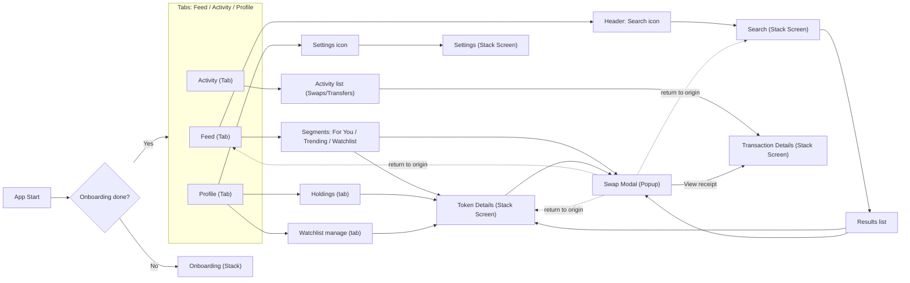
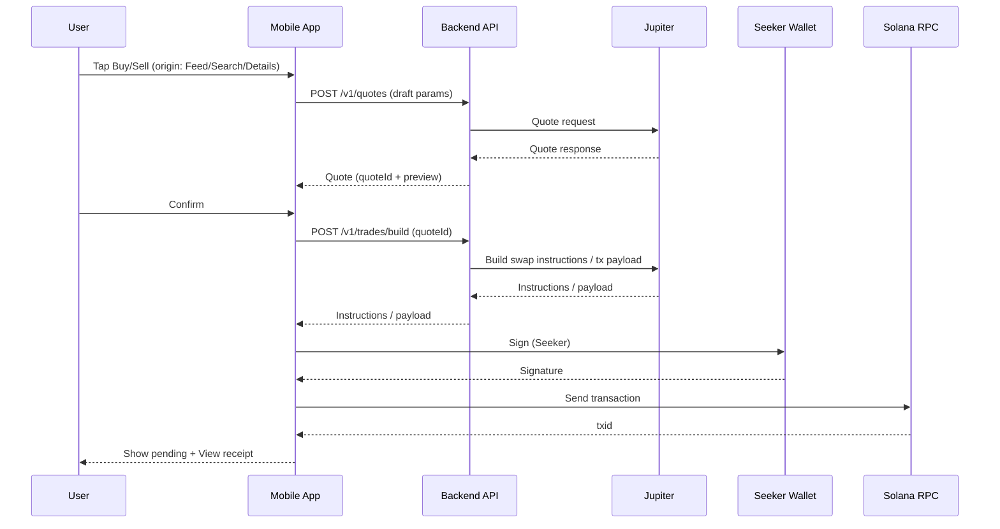

# ReelFlip — MVP Spec

Date: 2026-02-27 (updated 2026-03-09)
Status: In Progress

## 1. MVP Goal

Let the user quickly experience "browse tokens -> open token -> execute a real swap -> see the result in Activity", with minimal onboarding via Seeker wallet connection.

## 2. Scope

### In scope (MVP)

- **Wallet onboarding:** connect (Seeker) + terms + trading defaults (slippage / base currency).
- **Navigation:** 3 tabs (`Feed`, `Activity`, `Profile`) + stack screens (`Search`, `Token Details`, `Transaction Details`, `Settings`) + `Swap` as a popup modal.
- **Feed:** token feed with segments `For You / Trending / Watchlist` + Search button in header.
- **Search:** full search screen with results list.
- **Token Details:** chart + metrics + Watchlist toggle + Buy / Sell.
- **Swap modal:** Buy/Sell, amount, pay token selector `SOL / USDC / SKR`, slippage, review, signing, status.
- **Activity:** `Swaps / Transfers` events only, grouped by date, 30-day history, tap -> Tx details. Swaps show both legs (e.g. `-1.34 SOL` and `+23.34 SKR`).
- **Profile:** wallet summary + `Holdings` and `Watchlist (manage)` tabs + Settings icon (top-right).
- **Watchlist:** server-side source of truth (linked to wallet), management UI in Profile.

### Out of scope

- Comments / threads.
- Advanced discovery (complex filters, personalization beyond basic "For You").
- Fiat (USD) values in Activity (can add later).
- Custom on-chain transaction normalization (in MVP — use Helius).
- Token launch / bonding curve / graduation mechanics.

## 3. Navigation Flow



## 4. Screens

State notation: `L` = loading, `E` = empty, `X` = error.

### 4.1 Onboarding (Stack) — DONE

Steps: `Welcome -> Connect Wallet (Seeker) -> Terms/Permissions -> Defaults -> Enter App`

States: `X` (connection error) + retry.

Actions: Connect wallet, Accept terms, Set defaults (slippage, base currency).

### 4.2 Feed (Tab) — DONE

Segments: `For You / Trending / Watchlist`. Header: Search icon. Token Card: tap -> Token Details, Buy/Sell -> Swap modal.

States: `L` (initial load), `E` (no items / watchlist empty), `X` (network error) + retry.

> Note: Buy/Sell buttons open the full swap modal with live Jupiter quotes and wallet signing. Watchlist segment tab shows a placeholder message — requires backend Watchlist API.

### 4.3 Search (Stack Screen) — TODO

Search input + Results list: tap -> Token Details, Buy/Sell quick -> Swap modal.

States: `E` (no results), `X` (network error) + retry.

### 4.4 Token Details (Stack Screen) — TODO

Chart with time ranges (1H / 1D / 1W minimum). Metrics: volume, market cap, price change. Actions: watchlist toggle, buy, sell.

States: `L` (loading details), `X` + retry.

> Note: No dedicated Token Details screen exists. Chart and realtime streaming are implemented inline on feed cards. A standalone screen with metrics, watchlist toggle, and Buy/Sell → Swap wiring is still needed.

### 4.5 Swap Modal (Popup) — DONE

Entry points: Feed card, Search results, Token Details.

Steps: (1) Setup: side (Buy/Sell) + amount, (2) Pay with: SOL / USDC / SKR, (3) Slippage (presets + custom), (4) Review and confirm, (5) Signing (Seeker), (6) Result: success / fail + retry.

After success/close, return to origin screen. "View receipt" button navigates to Transaction Details.

States: `L` (quoting/building), `X` (quote/build/sign/send error).

> Note: Full 6-stage swap flow implemented (`features/swap/swap-flow.tsx`). Live Jupiter quotes via `POST /v1/quotes`, transaction building via `/v1/trades/build`, wallet signing via Seeker `signTransaction`, submission via `/v1/trades/submit`, and status polling via `/v1/trades/:tradeId/status`. Slippage reads from user's Settings preference. Slide-to-confirm gesture, haptic feedback, idempotency keys, and error handling (wallet rejection, quote expiry, simulation failure) all functional. Currently wired from Feed cards only; Search and Token Details entry points depend on those screens being built.

### 4.6 Activity (Tab) — DONE

Scope: `Swaps / Transfers` only, 30 days. Grouping: `Today`, `This Week`, `Earlier`. Swap row shows both legs. Transfer row shows one leg + counterparty. Tap -> Transaction Details.

States: `L`, `E`, `X` + retry.

> Note: Live Helius data connected end-to-end (REE-9). `useActivityQuery` polls `GET /v1/activity` with 5s stale time. Activity events grouped by date. Tapping a row navigates to Transaction Details with full event data. Dev mock mode available via `EXPO_PUBLIC_ACTIVITY_DEV_MOCK=true`.

### 4.7 Transaction Details (Stack Screen) — DONE

Status, amounts, tokens, tx hash (copy), fee, timestamp. Optional "View on explorer" link.

States: `L`, `X` + retry.

> Note: Fully implemented at `app/tx-details.tsx`. Shows status badge (Confirmed/Failed), transaction type, sent/received legs with icons, detail table (type, status, source, date, TX hash), copy-to-clipboard for signature, and "View on Explorer" button using cluster-aware URLs. Accessible from Activity rows and swap "View receipt".

### 4.8 Profile (Tab) — PARTIAL (UI done, data mock)

Header: wallet summary (.skr name, address copy) + Settings icon. Tabs: Holdings (token/asset list, tap -> Token Details), Watchlist manage (remove/unwatch, tap -> Token Details).

> Note: Full UI implemented matching Paper design — wallet header, portfolio balance, allocation bar, tab-switched Assets and Watchlist card lists, Settings navigation. Currently uses hardcoded mock data (`features/profile/mock-profile.ts`). Remaining: wire real wallet balances (Helius), implement watchlist management (requires backend Watchlist API).

### 4.9 Settings (Stack Screen) — DONE

Settings: slippage default, base currency, network cluster, wallet, biometrics, price alerts, reset app.

> Note: Fully implemented with main screen (Trading, Security, Network, About, Danger zone sections) and 4 sub-screens (Slippage with auto/1%/2%/custom, Base Currency, Solana Network, Wallet). Custom slippage input with decimal-pad keyboard. Animated toggle for biometrics/alerts. Reset confirmation dialog clears all state. All preferences persist via OnboardingProvider + AsyncStorage. Slippage setting connected to swap execution flow.

## 5. Data Contracts

### 5.1 FeedItem (Token card)

```typescript
interface FeedItem {
  mint: string
  symbol: string
  name: string
  imageUri?: string
  pairAddress?: string
  priceUsd?: number
  priceChange24h?: number
  marketCap?: number
  volume24h?: number
  liquidity?: number
  sparkline?: number[]
  sparklineMeta?: {
    window: '6h'
    interval: '1m' | '5m'
    source: string
    points: number
    generatedAt: string
  }
  tags?: { trust: string[]; discovery: string[] }
  labels?: string[]
  category?: string
  riskTier?: 'block' | 'warn' | 'allow'
  sources?: { price: string; marketCap: string; metadata: string; tags: string[] }
}
```

### 5.2 ActivityEvent (UI model)

```typescript
interface ActivityEvent {
  id: string          // txid + index
  txid: string
  timestamp: string   // ISO 8601
  status: 'confirmed' | 'failed'
  kind: 'swap' | 'transfer'
  primary: {
    mint: string
    symbol: string
    amount: string
    direction: 'in' | 'out'
  }
  secondary?: {       // for swaps
    mint: string
    symbol: string
    amount: string
    direction: 'in' | 'out'
  }
  counterparty?: {    // for transfers
    address: string
    label?: string
  }
}
```

### 5.3 SwapDraft (UI state)

```typescript
interface SwapDraft {
  side: 'buy' | 'sell'
  tokenMint: string
  payToken: 'SOL' | 'USDC' | 'SKR'
  amount: string
  slippageBps: number
}
```

### 5.4 UserSettings

```typescript
interface UserSettings {
  slippageBps: number
  baseCurrency: 'USD' | 'EUR' | string
  defaultPayToken?: 'SOL' | 'USDC' | 'SKR'
}
```

### 5.5 WatchlistEntry

```typescript
interface WatchlistEntry {
  mint: string
  addedAt: string     // ISO 8601
}
```

## 6. Backend API Summary

Full API details: see [api-contract.md](./api-contract.md).

Implemented: `GET /health`, `GET /v1/feed`, `GET /v1/activity`, Chart endpoints (REST + WebSocket + SSE), `POST /v1/quotes`, `POST /v1/trades/build`, `POST /v1/trades/submit`, `GET /v1/trades/:tradeId/status`.

Planned for MVP: Auth (`/v1/auth/*`), Search (`/v1/search`), Watchlist (`/v1/watchlist`). Settings are currently client-side only (AsyncStorage).

## 7. Swap Flow (Sequence)



## 8. Acceptance Criteria (MVP)

- User completes onboarding and lands on Feed.
- Feed shows `For You / Trending / Watchlist` segments and a Search button.
- User can open Token Details from Feed, Search, or Profile (Holdings / Watchlist).
- User can open Swap modal from Feed card, Search results, or Token Details.
- After successful swap: modal closes -> return to origin screen; "View receipt" button -> Transaction Details; event appears in Activity within reasonable delay.
- Activity shows only swaps/transfers for 30 days, grouped by date, swaps displayed with both legs.

## 9. Open Questions

- Chart format (candles vs sparkline) and time intervals for Token Details.
- Cache/pagination policy for Feed and Activity.
- "For You" ranking algorithm (initial versions can use simple rules).
- Watchlist API: server-side storage design (linked to wallet address vs auth token).
