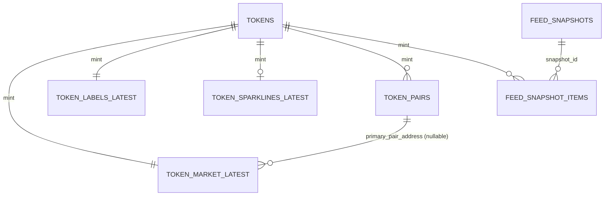

# Supabase Data Schema

Date: March 5, 2026  
Source project: `https://fudqujptiwtvaumadymw.supabase.co`  
Schema: `public`  
Scope: live schema snapshot (tables, view, keys, constraints, indexes, RLS)

## Entity Relationship Overview

## Objects

| Object | Type | RLS | Approx rows |
|---|---|---|---:|
| `tokens` | table | enabled | 642 |
| `token_pairs` | table | enabled | 642 |
| `token_market_latest` | table | enabled | 642 |
| `token_labels_latest` | table | enabled | 642 |
| `token_sparklines_latest` | table | enabled | 543 |
| `token_candles_1m` | table | enabled | 79,656 |
| `feed_snapshots` | table | enabled | 2,484 |
| `feed_snapshot_items` | table | enabled | 165,518 |
| `v_token_feed` | view | n/a | n/a |

## Table Definitions

### `tokens`

Primary key: `mint`

| Column | Type | Nullable | Default |
|---|---|---|---|
| `mint` | text | no | |
| `name` | text | no | |
| `symbol` | text | no | |
| `description` | text | yes | |
| `image_uri` | text | yes | |
| `first_seen_at` | timestamptz | no | `now()` |
| `updated_at` | timestamptz | no | `now()` |

### `token_pairs`

Primary key: `pair_address`  
Foreign keys:
- `mint` -> `tokens.mint` (`ON DELETE CASCADE`)

| Column | Type | Nullable | Default |
|---|---|---|---|
| `pair_address` | text | no | |
| `mint` | text | no | |
| `dex` | text | no | |
| `quote_symbol` | text | yes | |
| `pair_created_at_ms` | int8 | yes | |
| `updated_at` | timestamptz | no | `now()` |
| `ingested_at` | timestamptz | yes | |
| `source_discovery` | text | no | |

### `token_market_latest`

Primary key: `mint`  
Foreign keys:
- `mint` -> `tokens.mint` (`ON DELETE CASCADE`)
- `primary_pair_address` -> `token_pairs.pair_address` (`ON DELETE SET NULL`)

| Column | Type | Nullable | Default |
|---|---|---|---|
| `mint` | text | no | |
| `price_usd` | numeric | no | |
| `price_change_24h` | numeric | no | |
| `volume_24h` | numeric | no | |
| `liquidity` | numeric | no | |
| `market_cap` | numeric | yes | |
| `recent_volume_5m` | numeric | yes | |
| `recent_txns_5m` | int4 | yes | |
| `updated_at` | timestamptz | no | |
| `primary_pair_address` | text | yes | |
| `source_price` | text | no | |
| `source_market_cap` | text | no | |
| `source_liquidity` | text | no | |
| `source_volume` | text | no | |
| `source_metadata` | text | no | |
| `ingested_at` | timestamptz | yes | |

### `token_labels_latest`

Primary key: `mint`  
Foreign keys:
- `mint` -> `tokens.mint` (`ON DELETE CASCADE`)

Checks:
- `category IN ('trending','gainer','new','memecoin')`
- `risk_tier IN ('block','warn','allow')`

| Column | Type | Nullable | Default |
|---|---|---|---|
| `mint` | text | no | |
| `category` | text | no | |
| `risk_tier` | text | no | |
| `trust_tags` | text[] | no | `'{}'::text[]` |
| `discovery_labels` | text[] | no | `'{}'::text[]` |
| `source_tags` | text[] | no | `'{}'::text[]` |
| `updated_at` | timestamptz | no | |
| `source_labels` | text | no | `'derived'::text` |
| `ingested_at` | timestamptz | yes | |

### `token_sparklines_latest`

Primary key: `mint`  
Foreign keys:
- `mint` -> `tokens.mint` (`ON DELETE CASCADE`)

Checks:
- `window = '6h'`
- `interval IN ('1m','5m')`

| Column | Type | Nullable | Default |
|---|---|---|---|
| `mint` | text | no | |
| `window` | text | no | |
| `interval` | text | no | |
| `points` | int4 | no | |
| `source` | text | no | |
| `generated_at` | timestamptz | no | |
| `history_quality` | text | yes | |
| `sparkline` | numeric[] | no | |
| `point_count_1m` | int4 | yes | |
| `last_point_time_sec` | int8 | yes | |
| `updated_at` | timestamptz | no | `now()` |
| `ingested_at` | timestamptz | yes | |

### `token_candles_1m`

Primary key: `(pair_address, time_sec)`
Foreign keys:
- `pair_address` -> `token_pairs.pair_address` (`ON DELETE CASCADE`)

| Column | Type | Nullable | Default |
|---|---|---|---|
| `pair_address` | text | no | |
| `open` | numeric | no | |
| `high` | numeric | no | |
| `low` | numeric | no | |
| `close` | numeric | no | |
| `volume` | numeric | no | |
| `sample_count` | int4 | no | |
| `time_sec` | int8 | no | |
| `source` | text | no | |
| `updated_at` | timestamptz | no | |
| `ingested_at` | timestamptz | yes | |

### `feed_snapshots`

Primary key: `id`

Checks:
- `source IN ('providers','seed')`
- `cache_status IN ('HIT','MISS','STALE')`

| Column | Type | Nullable | Default |
|---|---|---|---|
| `id` | uuid | no | `gen_random_uuid()` |
| `generated_at` | timestamptz | no | |
| `source` | text | no | |
| `cache_status` | text | no | |
| `item_count` | int4 | no | |

### `feed_snapshot_items`

Primary key: `(snapshot_id, position)`  
Unique: `(snapshot_id, mint)`  
Foreign keys:
- `snapshot_id` -> `feed_snapshots.id` (`ON DELETE CASCADE`)
- `mint` -> `tokens.mint` (`ON DELETE CASCADE`)

| Column | Type | Nullable | Default |
|---|---|---|---|
| `snapshot_id` | uuid | no | |
| `position` | int4 | no | |
| `mint` | text | no | |
| `score` | numeric | no | |

## View Definition

### `v_token_feed`

View options:
- `security_invoker = false`
- `security_barrier = true`

Joined read model over:
- `tokens`
- `token_market_latest`
- `token_labels_latest`
- optional `token_pairs` via `token_market_latest.primary_pair_address`
- optional `token_sparklines_latest`

Publishes merged feed fields including:
- core token identity (`mint`, `name`, `symbol`, `description`, `imageUri`)
- market projection (`priceUsd`, `priceChange24h`, `volume24h`, `liquidity`, `marketCap`)
- pair metadata (`pairAddress`, `pairCreatedAtMs`, `quoteSymbol`)
- short-window metrics (`recentVolume5m`, `recentTxns5m`)
- sparkline payload and metadata (`sparkline`, `sparklineMeta`)
- labels/tags/source provenance (`labels`, `tags`, `sources`, `category`, `riskTier`)

## Indexes

### `tokens`
- `tokens_pkey (unique btree: mint)`

### `token_pairs`
- `token_pairs_pkey (unique btree: pair_address)`
- `idx_token_pairs_mint_updated_at_desc (btree: mint, updated_at desc)`

### `token_market_latest`
- `token_market_latest_pkey (unique btree: mint)`
- `idx_token_market_latest_primary_pair_address (btree: primary_pair_address)`
- `idx_token_market_latest_updated_at_desc (btree: updated_at desc)`
- `idx_token_market_latest_volume_24h_desc (btree: volume_24h desc)`
- `idx_token_market_latest_market_cap_desc (btree: market_cap desc)`

### `token_labels_latest`
- `token_labels_latest_pkey (unique btree: mint)`
- `idx_token_labels_latest_risk_tier_updated_at_desc (btree: risk_tier, updated_at desc)`

### `token_sparklines_latest`
- `token_sparklines_latest_pkey (unique btree: mint)`

### `token_candles_1m`
- `token_candles_1m_pkey (unique btree: pair_address, time_sec)`
- `idx_token_candles_1m_pair_time_sec_desc (btree: pair_address, time_sec desc)`
- `idx_token_candles_1m_time_sec_desc (btree: time_sec desc)`

### `feed_snapshots`
- `feed_snapshots_pkey (unique btree: id)`
- `idx_feed_snapshots_generated_at_desc (btree: generated_at desc)`

### `feed_snapshot_items`
- `feed_snapshot_items_pkey (unique btree: snapshot_id, position)`
- `feed_snapshot_items_snapshot_id_mint_key (unique btree: snapshot_id, mint)`
- `idx_feed_snapshot_items_mint (btree: mint)`

## RLS and Policies

RLS is enabled on all `public` tables listed above.

Policies currently present in `public`:
- `feed_snapshots_deny_client_read`: `SELECT` for `{anon, authenticated}` with condition `false`
- `feed_snapshot_items_deny_client_read`: `SELECT` for `{anon, authenticated}` with condition `false`

Client access posture:
- `anon` and `authenticated` can read `public.v_token_feed`.
- `anon` and `authenticated` do not have `SELECT` on base tables.

## Migration Baseline

Applied migrations currently registered in Supabase:
- `20260303183010 token_domain_schema_v1_fix`
- `20260303191940 token_domain_schema_policy_fix`
- `20260303215054 token_domain_perf_index`
- `20260303215331 token_domain_fk_index`
- `20260305140731 stage2_token_domain_05_nullable_market_cap_backfill`
- `20260305142338 stage2_token_domain_06_diff_aware_upserts`
- `20260305142758 stage2_token_domain_01_cutover`
- `20260305142819 stage2_token_domain_02_constraints_indexes`
- `20260305142832 stage2_token_domain_03_views_policies`
- `20260305142842 stage2_token_domain_04_cleanup`
- `20260305142904 stage2_token_domain_06_read_surface_hardening`
- `20260305144957 stage2_token_domain_05_source_provenance_fix`
- `20260305152235 stage2_token_domain_08_read_surface_fk_index_cleanup`
