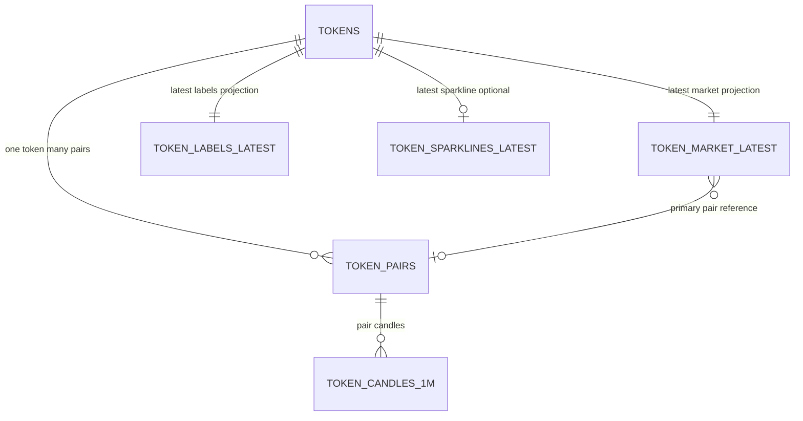

# Supabase Token Domain Stage 1 Contract

Date: March 5, 2026  
Status: Finalized for Stage 2 implementation handoff  
Scope: Design contract only (no SQL migration or runtime code changes in Stage 1)

## Purpose
This document freezes the token-domain data model contract for Supabase so Stage 2 can implement migrations and constraints without open schema decisions.

Normative baseline for current implementation:
- [backend/supabase/migrations/20260303_token_domain_schema.sql](/Users/rawchenko/Documents/GitHub/ReelFlip/backend/supabase/migrations/20260303_token_domain_schema.sql)

## Canonical Model (Target)

### Design Rules
1. `tokens` is metadata-only and must not store sparkline arrays or chart history blobs.
2. `token_pairs` is the canonical many-side relation for a token's market venues.
3. `token_market_latest` remains one row per mint and may reference a primary pair.
4. `token_candles_1m` canonical uniqueness is `(pair_address, time_sec)`.
5. Source and freshness fields are explicit on volatile data.

## Table Contracts

### `tokens` (static token metadata)
Conflict target: `(mint)`

| Column | Type | Null | Notes |
|---|---|---|---|
| `mint` | text | no | PK, canonical mint key. |
| `name` | text | no | Current display name. |
| `symbol` | text | no | Current display symbol. |
| `description` | text | yes | Nullable metadata. |
| `image_uri` | text | yes | Nullable metadata. |
| `first_seen_at` | timestamptz | no | First observation in ingest. |
| `updated_at` | timestamptz | no | Last business-value metadata change. |

### `token_pairs` (pair registry per mint)
Conflict target: `(pair_address)`

| Column | Type | Null | Notes |
|---|---|---|---|
| `pair_address` | text | no | PK, canonical pair key. |
| `mint` | text | no | FK -> `tokens.mint`. |
| `dex` | text | no | DEX/venue identifier (`dexscreener`, etc.). |
| `quote_symbol` | text | yes | Quote asset symbol when available. |
| `pair_created_at_ms` | bigint | yes | Source pair creation timestamp (ms epoch). |
| `updated_at` | timestamptz | no | Last business-value change for pair metadata. |
| `ingested_at` | timestamptz | yes | Last successful write timestamp (ingest clock). |
| `source_discovery` | text | no | Discovery source for this pair row. |

### `token_market_latest` (one-row latest market projection per mint)
Conflict target: `(mint)`

| Column | Type | Null | Notes |
|---|---|---|---|
| `mint` | text | no | PK/FK -> `tokens.mint`. |
| `primary_pair_address` | text | yes | FK -> `token_pairs.pair_address`, nullable if missing. |
| `price_usd` | numeric | no | Latest price projection. |
| `price_change_24h` | numeric | no | Latest 24h change projection. |
| `volume_24h` | numeric | no | Latest 24h volume projection. |
| `liquidity` | numeric | no | Latest liquidity projection. |
| `market_cap` | numeric | yes | Nullable if unavailable. |
| `recent_volume_5m` | numeric | yes | Optional short-window metric. |
| `recent_txns_5m` | integer | yes | Optional short-window metric. |
| `source_price` | text | no | Provenance for `price_usd`. |
| `source_market_cap` | text | no | Provenance for `market_cap`. |
| `source_liquidity` | text | no | Provenance for `liquidity`. |
| `source_volume` | text | no | Provenance for `volume_24h`. |
| `source_metadata` | text | no | Metadata provenance used in feed shape compatibility. |
| `updated_at` | timestamptz | no | Last business-value change in market projection. |
| `ingested_at` | timestamptz | yes | Last successful write timestamp (ingest clock). |

### `token_labels_latest` (one-row latest labels/risk per mint)
Conflict target: `(mint)`

| Column | Type | Null | Notes |
|---|---|---|---|
| `mint` | text | no | PK/FK -> `tokens.mint`. |
| `category` | text | no | Enum: `trending | gainer | new | memecoin`. |
| `risk_tier` | text | no | Enum: `block | warn | allow`. |
| `trust_tags` | text[] | no | Default empty array. |
| `discovery_labels` | text[] | no | Default empty array. |
| `source_tags` | text[] | no | Default empty array for provider/system tag sources. |
| `source_labels` | text | no | Provenance for label/category derivation. |
| `updated_at` | timestamptz | no | Last business-value change in labels/risk. |
| `ingested_at` | timestamptz | yes | Last successful write timestamp (ingest clock). |

### `token_sparklines_latest` (one-row latest sparkline per mint)
Conflict target: `(mint)`

| Column | Type | Null | Notes |
|---|---|---|---|
| `mint` | text | no | PK/FK -> `tokens.mint`. |
| `window` | text | no | Stage 1 fixed value: `6h`. |
| `interval` | text | no | Enum: `1m | 5m`. |
| `points` | integer | no | Number of sparkline points. |
| `source` | text | no | Sparkline history provider/source. |
| `history_quality` | text | yes | History quality enum from chart pipeline. |
| `point_count_1m` | integer | yes | Count of raw 1m points used to build sparkline. |
| `last_point_time_sec` | bigint | yes | Last raw point timestamp in epoch seconds. |
| `sparkline` | numeric[] | no | Materialized sparkline series. |
| `generated_at` | timestamptz | no | Sparkline generation time from chart read. |
| `updated_at` | timestamptz | no | Last business-value change in sparkline payload/meta. |
| `ingested_at` | timestamptz | yes | Last successful write timestamp (ingest clock). |

### `token_candles_1m` (high-volume historical candles by pair)
Conflict target: `(pair_address, time_sec)`

| Column | Type | Null | Notes |
|---|---|---|---|
| `pair_address` | text | no | FK -> `token_pairs.pair_address`. |
| `time_sec` | bigint | no | 1m bucket timestamp in epoch seconds. |
| `open` | numeric | no | Candle OHLCV. |
| `high` | numeric | no | Candle OHLCV. |
| `low` | numeric | no | Candle OHLCV. |
| `close` | numeric | no | Candle OHLCV. |
| `volume` | numeric | no | Candle OHLCV. |
| `sample_count` | integer | no | Number of source samples aggregated into the bucket. |
| `source` | text | no | Source/provider for this candle row. |
| `updated_at` | timestamptz | no | Last business-value change for row. |
| `ingested_at` | timestamptz | yes | Last successful write timestamp (ingest clock). |

## Freshness and Source Conventions

### `updated_at`
- Meaning: timestamp of last business-value change for the row.
- Rule: do not bump `updated_at` when a retry writes identical values.

### `ingested_at`
- Meaning: timestamp when ingest pipeline successfully wrote this row.
- Rule: may advance on idempotent writes; used for operational observability and lag tracking.
- Scope: optional but recommended for all volatile tables.

### `source*`
- Meaning: provenance for field values when multiple providers exist.
- Rule: use per-field source columns for merged projections (`source_price`, `source_market_cap`, etc.) and `source` for single-origin payload tables (candles/sparklines).

## Candle Retention Policy
- Default retention: 14 days for `token_candles_1m`.
- Runtime override: `TOKEN_CANDLE_RETENTION_DAYS` stays authoritative.
- Prune trigger: prune runs on ingest cadence (`TokenIngestJob`) after snapshot refresh cycle.
- Prune semantics: delete rows older than `now - retention_window`.

Required query support under this policy:
1. Recent-history read: latest N candles for a pair ordered by newest bucket.
2. Range read: bounded interval queries by pair and time range.
3. Prune efficiency: range deletes by time cutoff without full-table scan.

## Current vs Target Delta

| Area | Current baseline | Stage 1 target contract |
|---|---|---|
| Pair modeling | Pair fields embedded in `token_market_latest` | Canonical `token_pairs`; `token_market_latest.primary_pair_address` references it |
| Candle key | `(pair_address, bucket_start)` with timestamptz key | `(pair_address, time_sec)` canonical uniqueness |
| Candle provenance/freshness | No explicit `source`, `updated_at`, `ingested_at` columns | Explicit source and freshness fields |
| Sparkline freshness | `generated_at` only | Keep `generated_at` and add row-level `updated_at` (+ optional `ingested_at`) |
| Source column naming | Mixed (`market_source_*`, `metadata_source`) | Standardized `source_*` semantics for merged fields |

## Feed Compatibility Mapping (Stage 2 Requirement)

The external feed payload shape remains unchanged while moving to target schema.

| Feed shape field (`v_token_feed`) | Target source |
|---|---|
| `pairAddress` | `token_market_latest.primary_pair_address` |
| `pairCreatedAtMs` | `token_pairs.pair_created_at_ms` via `primary_pair_address` |
| `quoteSymbol` | `token_pairs.quote_symbol` via `primary_pair_address` |
| `sources.price` | `token_market_latest.source_price` |
| `sources.marketCap` | `token_market_latest.source_market_cap` |
| `sources.metadata` | `token_market_latest.source_metadata` |
| `sources.tags` | `token_labels_latest.source_tags` |
| `sparkline` + `sparklineMeta` | `token_sparklines_latest` |
| `category` + `riskTier` + `labels/tags` | `token_labels_latest` |

## Validation Scenarios
1. Multi-pair token: one `mint` has two rows in `token_pairs`, while `token_market_latest` references one `primary_pair_address`.
2. Metadata purity: `tokens` has no market/sparkline/candle arrays.
3. Freshness completeness: every volatile table contract defines source/freshness fields.
4. Retention completeness: retention default, override, and prune owner are explicit.
5. Compatibility completeness: mapping to current feed shape is explicit.

Example multi-pair modeling (conceptual):
- `tokens`: `mint=So111...`
- `token_pairs`: `pair_address=pairA`, `mint=So111...`; `pair_address=pairB`, `mint=So111...`
- `token_market_latest`: `mint=So111...`, `primary_pair_address=pairA`

## Stage 2 Readiness Checklist
- [x] Canonical table and column names frozen in this contract.
- [x] Upsert conflict targets identified for all target tables.
- [x] Backward-compatible feed read-shape mapping documented.
- [x] Current-vs-target deltas captured for migration planning.
- [x] Unresolved decision list is empty.

## Unresolved Decisions
None.
