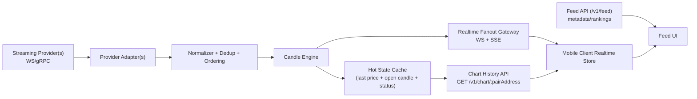

# System Design: Realtime Market Data and Candle Pipeline (ReelFlip)

Date: February 26, 2026  
Revised: February 26, 2026 (post-code audit)  
Status: Reviewed — ready for Phase 1 implementation  
Owner: ReelFlip engineering

## 1. Summary

This document defines a production-ready architecture for realtime token price updates and accurate candle generation for the ReelFlip feed UI.

It replaces the current "poll REST snapshot -> approximate candle" behavior with a phased design centered on a realtime tick/trade stream, while preserving the current HTTP chart endpoints during migration.

Primary outcomes:

- Realtime visible UI updates (target: <= 1s perceived latency)
- Server-generated candles from normalized tick/trade events
- Shared realtime data source for chart + large price label
- Clear degraded mode when realtime source/transport is unavailable

## 2. Problem Statement

Current behavior in the repo:

- Backend chart provider polls DexScreener REST snapshots (`backend/src/chart/chart.provider.dexscreener.ts`)
- Candle engine builds 1m candles from periodic snapshots (`backend/src/chart/chart.aggregator.ts`)
- Mobile UI uses fetch-based SSE for chart events (`features/feed/api/chart-client.ts`)
- Feed card price (`item.priceUsd`) updates on feed polling cadence (default ~5s), not the chart stream

Result:

- Candles are not "actual" trade-derived candles
- UI can feel stale or inconsistent (chart and price on different clocks)
- RN fetch/SSE support can be unreliable and may fall back to polling

## 3. Goals and Non-Goals

### Goals

- Deliver realtime price movement to mobile UI with <= 1s visible updates under normal conditions
- Generate accurate OHLCV candles from a tick/trade stream (not periodic snapshots)
- Keep the current `/v1/chart/:pairAddress` history endpoint contract during migration
- Provide a resilient degraded mode (fallback provider / fallback transport)
- Add observability for source lag, fanout lag, reconnects, and candle health

### Non-Goals (Phase 1)

- Sub-500ms HFT-grade latency
- Multi-chain support beyond current Solana focus
- Full long-term historical warehousing in the first milestone
- Advanced chart intervals beyond `1m` (can be added later)

## 4. Requirements

### Functional

- Bootstrap chart history for a pair
- Realtime updates for:
- current/open candle mutation
- last traded price (for card price display)
- stream health status (`live`, `delayed`, `reconnecting`, `fallback_polling`)
- Degrade gracefully to polling/snapshot mode when realtime source is unavailable

### Non-Functional

- P95 end-to-end UI freshness target: <= 1s from source event to visible update
- No app crashes on backend/network failure
- Horizontal fanout support for many subscribed pairs (future-ready)
- Backward compatibility for current mobile chart screens during migration

## 5. Current State (Repo Alignment)

> All files below were verified against the repo on 2026-02-26.

### Backend (implemented today)

| File | Role | Verified |
|---|---|---|
| `backend/src/chart/chart.types.ts` | Shared types (`ChartProvider`, `OhlcCandle`, `ChartStreamEvent`, `ChartStreamStatus`) | ✅ |
| `backend/src/chart/chart.provider.dexscreener.ts` | Fetches DexScreener REST snapshots, implements `ChartProvider` | ✅ |
| `backend/src/chart/chart.aggregator.ts` | Builds 1m OHLC candles from `ChartTickSample` | ✅ |
| `backend/src/chart/chart.registry.ts` | Pair runtime state, polling orchestration, SSE subscriber fanout | ✅ |
| `backend/src/chart/chart.route.ts` | `GET /v1/chart/:pairAddress` and `GET /v1/chart/stream` (SSE) | ✅ |
| `backend/src/chart/chart.aggregator.test.ts` | Unit tests for candle aggregation | ✅ |
| `backend/src/chart/chart.registry.test.ts` | Unit tests for registry/fanout | ✅ |

### Mobile client (implemented today)

| File | Role | Verified |
|---|---|---|
| `features/feed/api/chart-client.ts` | Chart history fetch + SSE stream via `runFetchSse` | ✅ |
| `features/feed/chart/use-feed-chart-realtime.ts` | Stream lifecycle, reconnect, polling fallback | ✅ |
| `features/feed/chart/chart-store.ts` | `FeedChartStore` — in-memory chart state with `useSyncExternalStore` | ✅ |
| `features/feed/chart/types.ts` | Client-side `ChartCandle`, `ChartStreamStatus` types | ✅ |
| `features/feed/token-card.tsx` | Renders chart and the large price label | ✅ |

### Backend dependencies (current)

- **Fastify** 5.7.4 (with `@fastify/cors`)
- **ioredis** 5.8.1 (already present)
- **tsx** for dev, **TypeScript** 5.9.2

### New dependency (Phase 1)

- **@fastify/websocket** (WebSocket transport for Fastify 5.x — wraps the `ws` library)

### Type alignment gaps (to fix before Phase 1)

- `ChartStreamStatus` is `'live' | 'delayed' | 'reconnecting'` — add `'fallback_polling'` (both backend and mobile `types.ts`)
- `ChartHistoryResponse.source` is literal `'dexscreener'` — widen in Phase 2 for multi-provider
- `ChartStreamEvent` has no `price_update` variant — deferred to Phase 2 (see §17 #2)

## 6. Proposed Architecture (Target)

### 6.1 High-Level Components

1. `Market Data Ingestion`
- Connects to one or more streaming market data providers (WebSocket/gRPC)
- Emits normalized tick/trade events into internal pipeline

2. `Normalization and Dedup Layer`
- Converts provider-specific payloads into a single `TradeTick` schema
- Deduplicates and orders events per pair
- Computes source lag metrics

3. `Candle Engine`
- Builds OHLCV candles from normalized ticks
- Emits `price_update`, `candle_update`, `candle_close`, `status`

4. `Realtime Fanout Gateway`
- Primary mobile transport: WebSocket
- Secondary/debug/web transport: SSE (existing route)
- Supports pair subscriptions and heartbeat

5. `History and Hot State`
- In-memory hot cache for latest candle and last price
- Optional Redis for cross-process fanout/state sharing
- Historical storage for backfill (phase 2+)

6. `Client Realtime Store`
- One source of truth for chart and large price label
- Feed API remains metadata/ranking source only

### 6.2 Data Flow



## 7. Core Data Models

## 7.1 Internal Event Schemas

### `TradeTick` (normalized)

```ts
type TradeTick = {
  pairAddress: string
  chainId: 'solana'
  tsMs: number
  priceUsd: number
  sizeBase?: number
  sizeQuoteUsd?: number
  txSig?: string
  seq?: string | number
  source: string
}
```

Notes:

- `txSig`/`seq` used for dedup if available
- `tsMs` should represent source event time, not local receive time

### `PriceUpdate`

```ts
type PriceUpdate = {
  type: 'price_update'
  pairAddress: string
  priceUsd: number
  sourceTsMs: number
  serverTime: string
  delayed: boolean
}
```

### `CandleUpdate`

```ts
type CandleUpdate = {
  type: 'candle_update'
  pairAddress: string
  interval: '1m'
  candle: {
    time: number
    open: number
    high: number
    low: number
    close: number
    volume?: number
  }
  isNewCandle: boolean
  isFinal?: boolean
  delayed: boolean
  serverTime: string
}
```

### `StatusEvent`

```ts
type StatusEvent = {
  type: 'status'
  pairAddress: string
  status: 'live' | 'delayed' | 'reconnecting' | 'fallback_polling'
  reason?: string
  serverTime: string
}
```

## 7.2 Hot Pair State (server)

```ts
type PairHotState = {
  pairAddress: string
  lastPriceUsd: number | null
  lastTradeTsMs: number | null
  candles1m: OhlcCandle[]
  status: 'live' | 'delayed' | 'reconnecting' | 'fallback_polling'
  source: 'streaming_provider' | 'dexscreener_poll'
}
```

## 8. API and Transport Design

## 8.1 Keep Existing HTTP History API (Backward Compatible)

Retain:

- `GET /v1/chart/:pairAddress?interval=1m&limit=120`

Behavior:

- Returns current best-known candles from the server candle engine
- `source` may remain a string (or evolve to indicate active provider)
- `delayed` reflects pair freshness state

## 8.2 Realtime Transport (New Primary for Mobile)

Add:

- `WS /v1/chart/ws`

Implementation:

- Use `@fastify/websocket` (wraps the `ws` library) — compatible with Fastify 5.x
- No conflicts with existing SSE routes (separate path)

Reason:

- React Native's built-in `WebSocket` API is well-supported and more reliable than fetch-stream SSE
- RN's `runFetchSse` in `chart-client.ts` has known unreliability documented in the codebase

Client messages:

```json
{ "op": "subscribe", "pairs": ["<pairAddress1>", "<pairAddress2>"], "interval": "1m" }
```

```json
{ "op": "unsubscribe", "pairs": ["<pairAddress1>"] }
```

Server messages:

- `snapshot`
- `price_update`
- `candle_update`
- `status`
- `heartbeat`

## 8.3 Existing SSE Endpoint (Secondary / Compatibility)

Keep:

- `GET /v1/chart/stream?pairs=...&interval=1m`

Use cases:

- Web/debug clients
- Transitional compatibility while mobile migrates to WebSocket

## 9. Backend Component Design (Repo-Oriented)

## 9.1 New/Updated Modules

### Keep and extend

- `backend/src/chart/chart.aggregator.ts`
  - Continue as candle builder
  - Extend to support volume accumulation and optional candle close/finalization event

- `backend/src/chart/chart.registry.ts`
  - Continue as pair runtime state + subscriber orchestration
  - Add support for provider-driven pushes (not only polling)
  - Fan out `price_update` in addition to `candle_update`

### Add

- `backend/src/chart/chart.provider.streaming.ts`
  - Streaming provider adapter (WebSocket/gRPC)

- `backend/src/chart/chart.normalizer.ts`
  - Provider payload -> `TradeTick`
  - Validation + normalization helpers

- `backend/src/chart/chart.dedup.ts`
  - Dedup/ordering per pair using `txSig`/`seq`/timestamp heuristics

- `backend/src/chart/chart.transport.ws.ts`
  - WebSocket endpoint implementation + subscription management

- `backend/src/chart/chart.hot-state.ts` (optional split)
  - Explicit last price / last trade time / status cache

## 9.2 Provider Strategy

Use a pluggable provider strategy behind the existing chart abstractions:

- `dexscreener_poll` (fallback/degraded mode)
- `streaming_provider` (primary)

Selection:

- Env-configured default primary
- Automatic fallback on provider outage
- Status event emitted when switching mode

## 10. Candle Engine Design

## 10.1 Candle Construction Rules (1m Phase)

- Bucket start = `Math.floor(tsMs / 60_000) * 60` seconds
- `open` = first tick price in bucket
- `high` = max tick price in bucket
- `low` = min tick price in bucket
- `close` = latest tick price in bucket
- `volume` = sum of trade volume when available

## 10.2 Late / Out-of-Order Tick Handling

Rules:

- Accept strictly increasing sequence per pair when source supplies sequence
- If no sequence, accept bounded lateness (configurable, e.g. <= 2s) if still in current open bucket
- Ignore stale ticks older than last finalized candle unless a later correction mode is introduced

Phase 1 simplification:

- No historical backfill correction for already-sent finalized candles

## 10.3 Emission Policy

- Emit `price_update` on each accepted tick (or sampled at max 5-10Hz if source is noisy)
- Emit `candle_update` when open candle changes
- Emit `status` on health transitions only

## 11. Mobile Client Design

## 11.1 State Ownership

Principle:

- Feed API (`/v1/feed`) provides discovery metadata and slow-changing fields
- Realtime chart stream provides fast-changing price and candle data

UI rendering rules:

- Large card price should render from realtime `lastPriceUsd` if available
- Fallback to feed `item.priceUsd` if no realtime state exists
- 24h change / volume / liquidity remain feed-derived in phase 1

## 11.2 Transport Strategy

Preferred:

- WebSocket stream for mobile

Fallbacks:

1. SSE stream (`/v1/chart/stream`) if supported and working
2. 1s history polling (`GET /v1/chart/:pairAddress`) if streaming unavailable

The client should surface transport mode internally for logs:

- `ws`
- `sse`
- `polling_fallback`

## 11.3 Pair Subscription Strategy

Retain current mobile optimization concept:

- Subscribe only active card and nearby cards (active radius)
- Limit pairs per connection

But move limits to server-configurable client defaults and log when a desired pair is excluded.

## 12. Failure Modes and Degraded Behavior

## 12.1 Provider Outage / Lag

Symptoms:

- No ticks received
- source lag above threshold

Behavior:

- Emit `status=delayed`, then `status=reconnecting`
- Switch to fallback provider (DexScreener polling) when configured
- Continue serving history and approximate candles

## 12.2 Mobile Transport Failure

Symptoms:

- WS disconnects repeatedly
- SSE fetch body unsupported in RN runtime

Behavior:

- Exponential reconnect attempts
- Downgrade to polling fallback
- Emit/log transport mode and reason

## 12.3 Partial Data (No Volume / Sparse Ticks)

Behavior:

- Candles still emitted with OHLC only
- `volume` optional
- Status remains `live` if source lag is within threshold

## 13. Observability and SLOs

## 13.1 Metrics

### Source health

- `chart_source_tick_rate{provider,pair}`
- `chart_source_lag_ms{provider,pair}`
- `chart_provider_errors_total{provider}`

### Candle engine

- `chart_ticks_accepted_total{pair}`
- `chart_ticks_dropped_total{pair,reason}`
- `chart_candle_updates_emitted_total{pair,interval}`
- `chart_pair_status_transitions_total{from,to}`

### Fanout / transport

- `chart_ws_connections`
- `chart_ws_subscriptions_total`
- `chart_sse_connections`
- `chart_realtime_fanout_latency_ms`

### Client-reported diagnostics (optional)

- reconnect attempts
- transport mode usage (`ws`, `sse`, `polling_fallback`)
- polling cycle duration

## 13.2 Logs (Structured)

Required log events:

- provider connect/disconnect
- provider lag spikes
- poll cycle duration (fallback mode)
- status transitions (`live` -> `delayed` -> `reconnecting`)
- transport downgrade reason

## 13.3 Targets

- P95 source-to-server-ingest lag < 500ms (streaming provider mode)
- P95 server-to-client fanout lag < 250ms
- P95 visible UI freshness < 1s

## 14. Security and Abuse Considerations

- Validate pair subscription list size per client
- Rate-limit subscribe/unsubscribe churn
- Bound max active pairs globally and per connection
- Authenticate private/pro tier streams if introduced later
- Sanitize provider payloads and guard against malformed data

## 15. Rollout Plan (Phased)

## Phase 0: Current State Hardening (already started)

- Realtime card price uses chart latest candle close when available
- Add diagnostics for stream/polling fallback
- Add backend freshness and status observability

## Phase 1: Transport Upgrade (WebSocket, keep existing provider)

### Backend changes

| Action | File | Notes |
|---|---|---|
| **NEW** | `backend/src/chart/chart.transport.ws.ts` | WebSocket endpoint on `/v1/chart/ws` using `@fastify/websocket` |
| **MODIFY** | `backend/src/chart/chart.registry.ts` | Support WS clients in subscriber fanout alongside SSE listeners |
| **MODIFY** | `backend/src/chart/chart.route.ts` | Register the new WS route |
| **MODIFY** | `backend/src/chart/chart.types.ts` | Add `'fallback_polling'` to `ChartStreamStatus` union |

### Mobile changes

| Action | File | Notes |
|---|---|---|
| **MODIFY** | `features/feed/api/chart-client.ts` | Add `createChartStreamWs()` using RN's native `WebSocket` API |
| **MODIFY** | `features/feed/chart/use-feed-chart-realtime.ts` | Prefer WS → SSE → polling fallback chain |
| **MODIFY** | `features/feed/chart/types.ts` | Add `'fallback_polling'` to client `ChartStreamStatus` |

### Dependencies

- Add `@fastify/websocket` to backend `package.json`

Success criteria:

- Realtime transport stable on Android dev client
- Fewer `RECONNECTING` incidents caused by RN streaming limitations
- SSE and polling fallback paths remain functional

## Phase 2: True Realtime Source (streaming provider)

- Implement streaming provider adapter (`chart.provider.streaming.ts`)
- Add normalizer (`chart.normalizer.ts`) and dedup (`chart.dedup.ts`)
- Normalize to `TradeTick`
- Feed candle engine from streaming ticks
- Keep DexScreener poll as fallback
- Widen `ChartHistoryResponse.source` type from `'dexscreener'` to `string`

Success criteria:

- Price and candle updates visibly smoother and more frequent
- `delayed` status mostly correlates to true provider issues

## Phase 3: Persistence and Recovery

- Add Redis hot state and/or historical store (ioredis already in `package.json`)
- Warm startup snapshot/backfill
- Multi-instance fanout readiness

## 16. Testing Strategy

## 16.1 Unit Tests

- Candle aggregation (same-minute updates, new bucket creation, out-of-order ticks) — extend existing `chart.aggregator.test.ts`
- Dedup logic (duplicate txSig/seq)
- Status transitions and delayed thresholds — extend existing `chart.registry.test.ts`
- Provider failover decision logic
- WebSocket message parsing and subscription management

## 16.2 Integration Tests

- Subscribe → snapshot → realtime updates flow (WebSocket path)
- WebSocket disconnect/reconnect behavior
- SSE fallback behavior (existing path preserved)
- Polling fallback behavior when streaming unsupported
- Transport downgrade chain: WS → SSE → polling

## 16.3 Manual QA (Android)

- Backend reachable via `http://10.0.2.2:3001`
- Active card updates chart and large price from realtime source
- Kill/restart backend and verify status transitions and recovery
- Force streaming unsupported path and verify polling fallback updates
- Verify WebSocket auto-reconnection with exponential backoff

## 17. Open Decisions (To Lock Before Phase 1/2 Build)

1. **Streaming provider choice** — blocks Phase 2 only (managed vendor vs direct DEX/on-chain source)
2. **`price_update` event** — recommend deferring to Phase 2; infer price from `candle_update.close` in Phase 1 to keep scope tight
3. **WebSocket auth** — Phase 1 can use unauthenticated connections for dev; add signed token auth in Phase 2+ for production
4. **Redis introduction timing** — ioredis is already a dependency; can introduce hot state in Phase 2 or Phase 3 based on scaling needs
5. **Max fanout limits** — current `maxPairsPerStream` and `maxActivePairsGlobal` in `ChartRegistryOptions` already exist; extend to WS connections

## 18. Recommended Immediate Next Step

Implement Phase 1 (WebSocket transport) before provider migration.

Reason:

- It isolates mobile transport reliability from source quality
- It preserves current backend chart logic and endpoints
- It gives clear metrics to prove whether the next bottleneck is source freshness or transport
- All required abstractions (`ChartProvider`, `FeedChartStore`, `ChartStreamListener`) already exist and are tested

