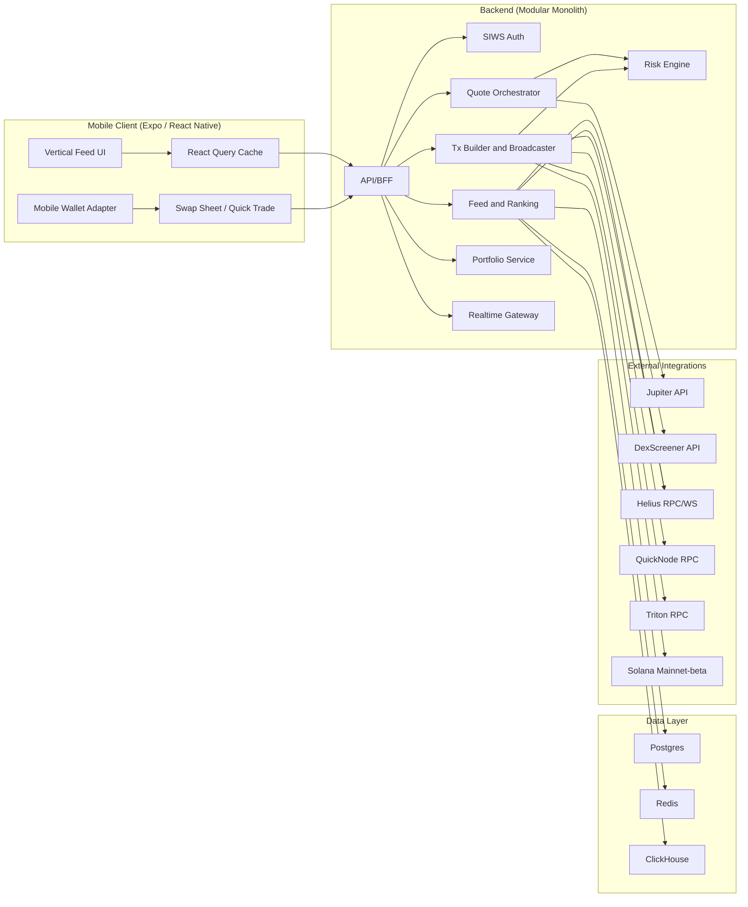
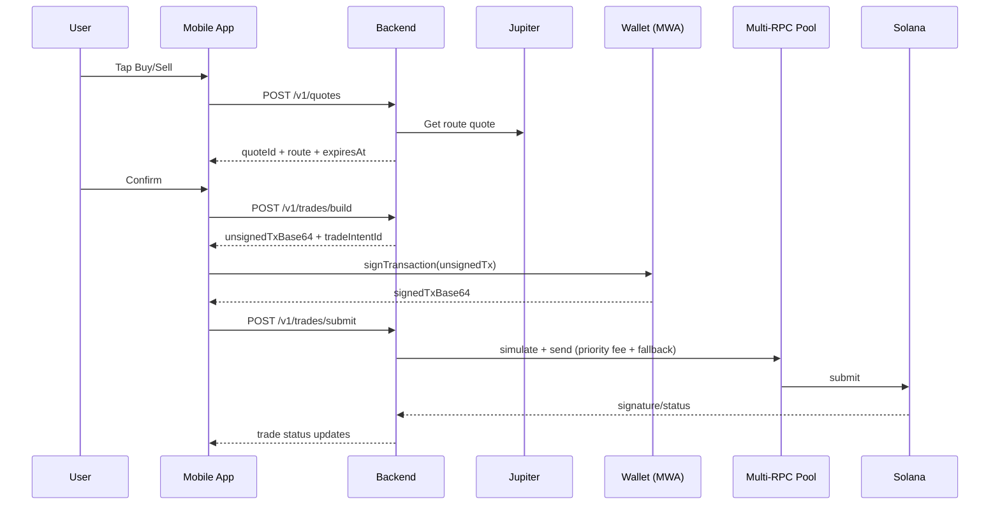

# ReelFlip - System Design v2

> TikTok-style token trading on Solana
> Android-first (Expo / React Native)
> Mainnet-first, non-custodial, trade-first MVP

---

## 1. Summary

This v2 merges the current hackathon-oriented design with a production-ready execution model.

- Keep: Expo + Mobile Wallet Adapter frontend model, TikTok-style feed UX, Jupiter swaps, DexScreener + Helius data sources.
- Upgrade: backend from thin edge proxy to a modular monolith with explicit trade orchestration, risk controls, multi-RPC broadcasting, observability, and SLO gates.
- Outcome: fast MVP delivery without limiting reliability and scale.

---

## 2. Product Vision

A vertical full-screen feed where each card is a tradable Solana token.  
Users discover tokens by swiping and execute buy/sell in 1-2 taps using wallet signatures.

---

## 3. High-Level Architecture (v2)



---

## 4. Frontend Architecture

### 4.1 Stack

- Expo 54 + React Native 0.81
- `expo-router`
- `@tanstack/react-query`
- `@wallet-ui/react-native-kit` (MWA)
- `@solana/kit`
- `react-native-reanimated` + `react-native-gesture-handler`

### 4.2 Screen Map

```text
app/
├── _layout.tsx
├── (tabs)/
│   ├── feed.tsx
│   ├── portfolio.tsx
│   ├── discover.tsx
│   └── profile.tsx
├── token/[mint].tsx
└── trade/[mint].tsx
```

### 4.3 Core Components

- `VerticalFeed`: paged card feed
- `TokenCard`: token stats + call-to-action
- `SwapSheet`: amount/slippage/confirm
- `MiniChart`: sparkline chart
- `TradeStatusPill`: `pending -> simulating -> submitted -> confirmed|failed`
- `PortfolioList`: balances and PnL

### 4.4 Feature Modules

```text
features/
├── account/      (existing)
├── network/      (existing)
├── feed/
├── token/
├── swap/
├── portfolio/
├── discover/
├── settings/
└── risk/         (display-only risk badges/warnings from backend decisions)
```

---

## 5. Backend Architecture

### 5.1 Why backend in v2

- Protect API keys (Jupiter, Helius, providers).
- Curate and rank feed server-side.
- Centralize trade policy and safety checks.
- Improve execution reliability with multi-RPC broadcast.
- Support realtime fanout and observability.

### 5.2 Runtime and modules

- Runtime: Node.js + TypeScript + NestJS/Fastify
- Modules:
  - `auth` (SIWS)
  - `feed` (ranking + pagination)
  - `quotes` (Jupiter quote + policy checks)
  - `trade` (build/simulate/broadcast/track)
  - `risk` (block/warn/allow)
  - `portfolio` (holdings/history/PnL)
  - `realtime` (trade/feed updates)
  - `notifications` (push events)

### 5.3 Data stores

- Postgres: users, settings, watchlists, trade intents, audit records.
- Redis: hot feed cache, quote cache, rate limits, pub/sub.
- ClickHouse: time-series, ranking analytics, product metrics.

### 5.4 Deployment and hosting (day one)

- App hosting target: AWS ECS Fargate (single service + worker tasks).
- Databases: managed Postgres and Redis (AWS RDS/ElastiCache or equivalent).
- Analytics: managed ClickHouse (Cloud).
- Edge/API entry: ALB + CloudFront + WAF.
- Secrets: AWS Secrets Manager + KMS.
- Fastest MVP alternative: Railway/Fly for API plus managed Postgres/Redis, then migrate to AWS before scale.

---

## 6. Trade Lifecycle (v2)



### 6.1 Trade status enum

`TradeStatus` state machine for UI and telemetry:

1. `pending`: trade intent created, waiting for wallet signature.
2. `simulating`: backend simulation and policy validation in progress.
3. `submitted`: transaction broadcast accepted by at least one RPC.
4. `confirmed`: on-chain confirmation reached target commitment.
5. `failed`: rejected by simulation, broadcast, or chain execution.

---

## 7. Feed and Ranking

- Inputs: DexScreener pair stats, Helius metadata, internal user behavior signals.
- Ranking dimensions:
  - Liquidity floor
  - Volume acceleration
  - Volatility controls
  - Risk penalties
  - Personalization weight
- Output: stable cursor-based feed with category tags (`trending`, `gainers`, `new`, `memecoin`).

### 7.1 Reference interfaces

```ts
type TradeStatus = 'pending' | 'simulating' | 'submitted' | 'confirmed' | 'failed'

interface TokenFeedItem {
  mint: string
  name: string
  symbol: string
  imageUri: string
  priceUsd: number
  priceChange24h: number
  volume24h: number
  liquidity: number
  marketCap: number
  sparkline: number[]
  pairAddress: string
  category: 'trending' | 'gainer' | 'new' | 'memecoin'
  riskTier: 'block' | 'warn' | 'allow'
}

interface PortfolioItem {
  mint: string
  symbol: string
  balance: string
  decimals: number
  valueUsd: number
  costBasisUsd?: number
  pnlUsd?: number
}
```

---

## 8. Security and Risk

- Non-custodial only.
- SIWS challenge/nonce/replay protection.
- Server-side quote/trade parameter validation.
- Mandatory pre-send simulation.
- Risk policy:
  - `block`: cannot trade
  - `warn`: explicit confirmation required
  - `allow`: normal flow
- Abuse controls: wallet/device/IP rate limits and anomaly checks.

---

## 9. Non-Functional Requirements

| Aspect | Target |
|---|---|
| Feed API latency | p95 < 200 ms |
| Quote API latency | p95 < 250 ms |
| Trade submit server latency | p95 < 400 ms (excluding chain confirmation) |
| First 5 feed cards | < 1.5 s (cached path) |
| Price freshness | <= 5 s |
| Availability | 99.9% for quote/submit endpoints |
| Rollout | Canary 5% -> 25% -> 100% with rollback gates |

---

## 10. Development Phases (Decision Complete)

### Phase 0 - Foundation

- Freeze dependencies and environment profiles.
- Add env and secrets conventions.
- Validate Android + backend local boot.

### Phase 1 - Feed and Wallet Core

- Build vertical feed UI and token cards.
- Integrate wallet connect/sign baseline.
- Implement `GET /v1/feed` with cached data path.

### Phase 2 - Trading Core

- Implement `POST /v1/quotes`, `POST /v1/trades/build`, `POST /v1/trades/submit`.
- Integrate SwapSheet and sign flow in app.
- Add transaction status UI states.

### Phase 3 - Reliability and Risk

- Add multi-RPC broadcaster and fallback logic.
- Add dynamic priority fee strategy.
- Implement risk engine and trade-time policy enforcement.

### Phase 4 - Portfolio and Realtime

- Implement holdings/history/PnL endpoints and mobile screens.
- Add websocket push for trade status and feed updates.
- Add push notification hooks.

### Phase 5 - Hardening and Launch

- Run load/security/chaos tests.
- Configure observability dashboards and SLO alerts.
- Execute mainnet canary rollout and stabilization window.

### Phase 6 - Post-MVP

- Social graph, comments, copy-trade.
- Advanced order types (DCA/TP/SL), which require significant backend infra (workers, schedulers, keeper-style execution).
- AI explainability for trending and risk signals.

---

## 11. Public APIs and Interface Changes

- Replace `GET /api/quote` + `POST /api/swap` with:
  - `POST /v1/quotes`
  - `POST /v1/trades/build`
  - `POST /v1/trades/submit`
  - `GET /v1/trades/:id/status` returning `TradeStatus`
- Add SIWS auth APIs:
  - `POST /v1/auth/challenge`
  - `POST /v1/auth/verify`
  - `POST /v1/auth/refresh`
  - `POST /v1/auth/logout`
- Add portfolio/risk APIs:
  - `GET /v1/portfolio/:wallet`
  - `GET /v1/history/:wallet`
  - `GET /v1/risk/:mint`
- Add websocket channels:
  - `trade.status.{wallet}`
  - `feed.updates`
  - `quote.invalidate.{wallet}`

---

## 12. Test Cases and Scenarios

1. SIWS success/failure/replay protection.
2. Feed cursor consistency and duplicate prevention.
3. Quote TTL expiry and requote path.
4. Trade submission with primary RPC failure fallback.
5. Simulation failure handling before user submit.
6. Wallet interruption/recovery during signing.
7. Risk policy enforcement (`block/warn/allow`).
8. Portfolio reconciliation against chain data.
9. Load tests meeting p95 targets.
10. Canary rollback trigger validation.

---

## 13. Assumptions and Defaults

- MVP scope is trade-first; social features are out of launch scope.
- Launch target is mainnet-beta (with staging soak and canary rollout).
- Custody model is strictly non-custodial.
- Jupiter is the primary routing engine.
- Helius is primary RPC with QuickNode/Triton failover.
- Backend remains modular monolith through MVP; split only when bottlenecks are measured.
- Default hosting for production path is AWS (ECS/RDS/ElastiCache + managed ClickHouse).
