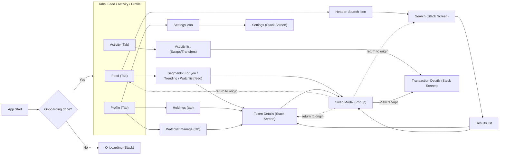
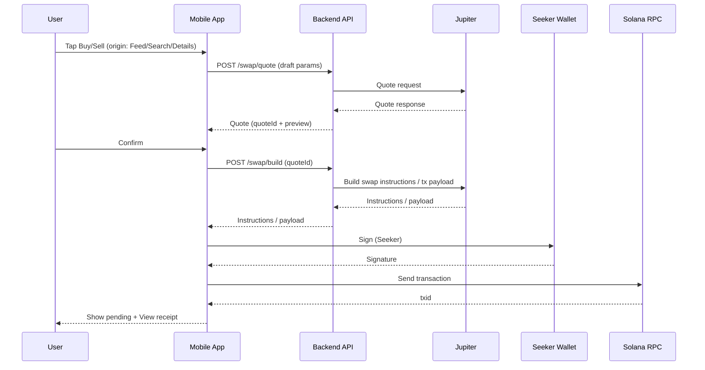

# ReelFlip — MVP Spec

Дата: 2026-02-27  
Статус: Draft (ready-for-build)

## 1) Цель MVP
Дать пользователю быстрый опыт “посмотреть токены → открыть токен → совершить реальный swap → увидеть результат в Activity”, с минимальным онбордингом через подключение кошелька (Seeker).

## 2) In scope / Out of scope

### In scope (MVP)
- Wallet onboarding: connect (Seeker) + terms + trading defaults (slippage/base currency).
- Навигация: 3 таба (`Feed`, `Activity`, `Profile`) + stack-экраны (`Search`, `Token Details`, `Transaction Details`, `Settings`) + `Swap` как popup modal.
- Feed: лента токенов + сегменты `For you / Trending / Watchlist` + кнопка Search в хедере.
- Search: полноценный экран поиска токенов с результатами.
- Token Details: chart + метрики + Watchlist toggle + Buy/Sell.
- Swap modal: Buy/Sell, amount, pay token selector `SOL / USDC / SKR`, slippage, review, signing, status.
- Activity: только события `Swaps/Transfers`, группировка по датам, 30 дней истории, tap → Tx details. Для swap показываем обе ноги (например `-1.34 SOL` и `+23.34 SKR`).
- Profile: wallet summary + вкладки `Holdings` и `Watchlist (manage)` + Settings иконкой (top-right).
- Watchlist: серверный source-of-truth (привязка к кошельку), UI для управления списком в Profile.

### Out of scope (not in MVP)
- Comments/threads.
- Advanced discovery (категории, сложные фильтры, персонализация beyond базовый “For you”).
- USD value (фиат) в Activity (можно добавить позже).
- Собственная нормализация транзакций из RPC (после MVP; в MVP можно через Helius).

## 3) Навигация (финальный flow)

## 4) Экраны (состояния + действия)

Нотация состояний: `L` = loading, `E` = empty, `X` = error.

### 4.1 Onboarding (Stack)
**Purpose:** подключить кошелёк и собрать минимальные настройки.
- Шаги: `Welcome → Connect Wallet (Seeker) → Terms/Permissions → Defaults → Enter App`
- States:
  - Connect: `X` (ошибка подключения) + retry.
- Actions:
  - `Connect wallet`
  - `Accept terms`
  - `Set defaults`: slippage, base currency

### 4.2 Feed (Tab)
**Purpose:** discovery токенов и быстрый вход в трейд.
- UI:
  - Segments: `For you / Trending / Watchlist`
  - Header: Search icon
  - Token Card: tap → `Token Details`, Buy/Sell → `Swap modal`
- States:
  - `L` при первичной загрузке
  - `E` (нет элементов / watchlist пуст)
  - `X` (ошибка сети) + retry

### 4.3 Search (Stack Screen)
**Purpose:** найти токен.
- UI:
  - Search input
  - Results list: tap → `Token Details`, Buy/Sell quick → `Swap modal`
- States:
  - `E` (нет результатов)
  - `X` (ошибка сети) + retry

### 4.4 Token Details (Stack Screen)
**Purpose:** детальный контекст по токену + действия.
- UI:
  - Chart + time ranges (минимально: 1D/1W/1M/All или 1H/1D/1W)
  - Metrics: volume, market cap, price change (набор уточняется)
  - Actions: watchlist toggle, buy, sell
- States:
  - `L` при загрузке деталей
  - `X` + retry

### 4.5 Swap Modal (Popup)
**Purpose:** совершить реальный swap.
- Entry points: из `Feed` карточки, из `Search results`, из `Token Details`.
- Key behavior:
  - После success/close возвращаемся **в origin screen** (откуда открыли).
  - Кнопка `View receipt` ведёт в `Transaction Details`.
- UI/Steps:
  1) Setup: side (Buy/Sell) + amount
  2) Pay with: `SOL / USDC / SKR` (по умолчанию последний выбранный)
  3) Slippage (presets + custom)
  4) Review & confirm
  5) Signing (Seeker)
  6) Result: success / fail + retry
- States:
  - `L` (quoting/building)
  - `X` (quote/build/sign/send error)

### 4.6 Activity (Tab)
**Purpose:** история действий кошелька.
- Scope: только `Swaps/Transfers`, 30 дней.
- UI:
  - Grouping headers: `Today`, `This Week`, `Earlier` (или по неделям)
  - Row (swap): две ноги (`- payToken amount`, `+ receiveToken amount`), status (pending/failed)
  - Row (transfer): одна нога (`+/- token amount`) + counterparty
  - Tap → `Transaction Details`
- States:
  - `L`, `E`, `X` + retry

### 4.7 Transaction Details (Stack Screen)
**Purpose:** receipt и детали транзакции.
- UI:
  - Status, amounts, tokens
  - Tx hash (copy), fee, time
  - (опц.) “View on explorer”
- States:
  - `L`, `X` + retry

### 4.8 Profile (Tab)
**Purpose:** управление аккаунтом/кошельком и watchlist.
- Header: wallet summary (.skr name, address copy) + Settings icon.
- Tabs:
  - Holdings: список токенов/активов, tap → `Token Details`
  - Watchlist (manage): список токенов, remove/unwatch, tap → `Token Details`

### 4.9 Settings (Stack Screen)
**Purpose:** изменить defaults после онбординга.
- Settings:
  - slippage default
  - base currency
  - disconnect wallet

## 5) Data contracts (draft)

### 5.1 FeedItem (Token card)
- `mint: string`
- `symbol: string`
- `name: string`
- `imageUri?: string`
- `pairAddress?: string`
- `priceUsd?: number`
- `priceChange24h?: number`
- `marketCap?: number`
- `volume24h?: number`
- `sparkline?: number[]`

### 5.2 SearchResult
- `mint: string`
- `symbol: string`
- `name: string`
- `imageUri?: string`
- `pairAddress?: string`
- `priceUsd?: number`

### 5.3 TokenDetails
- `mint: string`
- `symbol: string`
- `name: string`
- `imageUri?: string`
- `pairs: Array<{ pairAddress: string; dex?: string; liquidityUsd?: number }>`
- `chart: { points?: number[]; candles?: unknown[] }` (формат уточняется)
- `metrics: { priceUsd?: number; volume24h?: number; marketCap?: number; priceChange24h?: number }`
- `isWatchlisted: boolean`

### 5.4 SwapDraft (UI state)
- `side: 'buy' | 'sell'`
- `tokenMint: string` (целевой токен)
- `payToken: 'SOL' | 'USDC' | 'SKR'`
- `amount: string` (строка для UX)
- `slippageBps: number`

### 5.5 ActivityEvent (UI model)
- `id: string` (txid + index)
- `txid: string`
- `timestamp: string` (ISO)
- `status: 'pending' | 'confirmed' | 'failed'`
- `kind: 'swap' | 'transfer'`
- `primary: { mint: string; symbol: string; amount: string; direction: 'in' | 'out' }`
- `secondary?: { mint: string; symbol: string; amount: string; direction: 'in' | 'out' }` (для swap)
- `counterparty?: { address: string; label?: string }` (для transfer)

### 5.6 UserSettings
- `slippageBps: number`
- `baseCurrency: 'USD' | 'EUR' | string`
- `defaultPayToken?: 'SOL' | 'USDC' | 'SKR'`

### 5.7 WatchlistEntry
- `mint: string`
- `addedAt: string` (ISO)

## 6) Backend API (draft, minimal)

### Auth (wallet-based)
- `POST /auth/challenge` → `{ messageToSign, nonce, expiresAt }`
- `POST /auth/verify` `{ address, signature, nonce }` → `{ token }`

### Feed / Search (DexScreener via backend-proxy)
- `GET /feed?tab=for_you|trending|watchlist&cursor=...`
- `GET /search?q=...`
- `GET /token/:mint`

### Watchlist
- `GET /watchlist`
- `POST /watchlist` `{ mint }`
- `DELETE /watchlist/:mint`

### Settings
- `GET /settings`
- `PUT /settings` `{ slippageBps, baseCurrency, defaultPayToken? }`

### Swap (Jupiter)
- `POST /swap/quote` `{ tokenMint, payToken, amount, slippageBps, side }` → `{ quoteId, ... }`
- `POST /swap/build` `{ quoteId }` → `{ instructionsOrTxPayload }`

### Activity (Helius via backend-proxy)
- `GET /activity?days=30&cursor=...` → `{ events: ActivityEvent[], nextCursor?: string }`

## 7) Swap flow (sequence)

## 8) Acceptance criteria (MVP)
- Пользователь проходит onboarding и попадает в `Feed`.
- В `Feed` доступны `For you / Trending / Watchlist` и кнопка `Search`.
- Пользователь может открыть `Token Details` из Feed/Search/Profile (Holdings/Watchlist manage).
- Пользователь может открыть `Swap modal` из Feed карточки, из Search результатов и из Token Details.
- После swap success:
  - модалка закрывается → возврат в origin screen
  - доступна кнопка `View receipt` → `Transaction Details`
  - событие появляется в `Activity` (в пределах разумной задержки)
- `Activity` показывает только swaps/transfers за 30 дней, grouped by date, swap отображается двумя ногами.

## 9) Open questions (можно отложить)
- Формат chart (candles vs sparkline) и интервалы.
- Политика кэша/пагинации для Feed и Activity.
- “For you” ранжирование (первые версии можно сделать простыми правилами).

